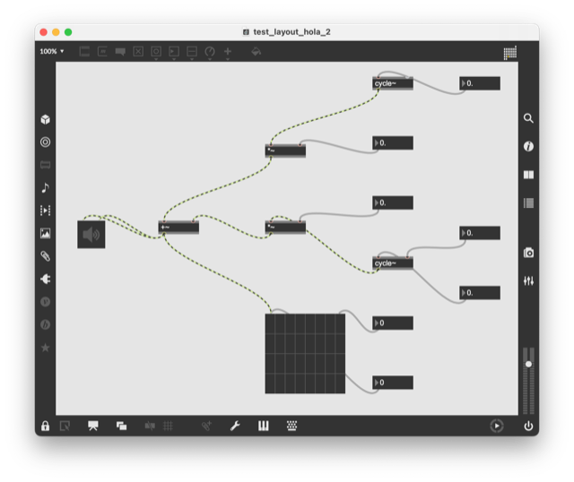
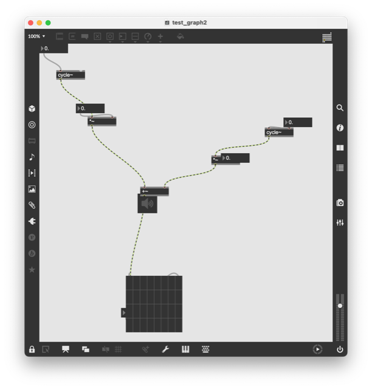

# Experimenting with Auto-layout Algorithms

This section provides a visual comparison of the results of different layout algorithm applied to the same set of objects. 

The default is a very basic grid layout algo that's implemented in the current `LayoutManager`. Other algorithms are provided by the following projects and have been tested in `py2max/tests`:

1. [networkx](https://networkx.org) - a general network analysis library in python.

2. [graphviz](https://graphviz.org) - well known graphing library (activated via networkx and [pygraphviz](https://github.com/pygraphviz/pygraphviz))

3. [adaptagrams hola](http://www.adaptagrams.org) - using the `libdialect` library and its HOLA algo: Human-like Orthogonal Network Layout

4. [tsmpy](https://github.com/uknfire/tsmpy) - An orthogonal layout algorithm, using the TSM approach covers some of the experimentation in various methods on how to auto-layout objects in a pymax generated file.

### The Default Layout

## Adaptagrams Layouts

### adaptagrams-hola Layout

## Networkx Layouts

### networkx-spring-layout Layout

### networkx-hamada-kawai Layout

### networkx-planar Layout

### networkx-shell Layout

### networkx-spectral Layout

### networkx-circular Layout

## Graphviz Layouts

### graphviz-dot Layout

### graphviz-neato Layout

### graphviz-fdp Layout

### graphviz-sfdp Layout

### graphviz-twopi Layout

## TSMP Layouts

### tsmp0-uselp Layout

### tsmp1-uselp Layout

### tsmp1 Layout

