# Layout Gallery

A visual comparison of the graph-layout algorithms py2max can drive, all
applied to the same sample patch (a small two-voice synth). Each image is
generated by `scripts/gen_layout_gallery.py`, which repositions the boxes with
a given backend and renders the result through py2max's own SVG exporter, so
the layouts are directly comparable.

Regenerate the gallery with:

```bash
make gallery
# or: uv run --extra graph python scripts/gen_layout_gallery.py
```

The layout engines are optional dependencies and are not imported by the core
library. Install them with `pip install "py2max[graph]"` (or
`uv sync --extra graph`). Three backends are supported:

- [graph-hola](https://github.com/shakfu/hola-graph) - a wrapper for the
  [adaptagrams](http://www.adaptagrams.org) HOLA algorithm (Human-like
  Orthogonal Network Layout).
- [graph-layout](https://github.com/shakfu/graph-layout) - pure-Python
  constraint-based (COLA) and force-directed / geometric layouts.
- [ogdf-py](https://github.com/shakfu/ogdf-py) - Python bindings for the
  [OGDF](https://ogdf.uos.de) C++ library (layered, force-directed, planar).

## Using these as py2max layout managers

Beyond the gallery script, every engine below is available as a first-class
layout manager. Pass `layout="graph:<algo>"` and call `optimize_layout()` once
the patch is built -- graph layouts need the whole graph, so they apply on
optimize rather than as each box is added:

```python
from py2max import Patcher

# HOLA orthogonal layout, applied directly to the patch
p = Patcher("synth.maxpat", layout="graph:hola")
osc = p.add_textbox("cycle~ 440")
flt = p.add_textbox("lores~ 800 0.7")
dac = p.add_textbox("ezdac~")
p.add_line(osc, flt)
p.add_line(flt, dac)
p.optimize_layout()   # graph:* layouts take effect here
p.save()

# ...or an OGDF layered layout on the same patch
p = Patcher("synth.maxpat", layout="graph:ogdf-sugiyama")
# ...add boxes and lines...
p.optimize_layout()
```

Available selectors (`graph:<name>`): `hola`, `cola`, `sugiyama`,
`fruchterman-reingold`, `kamada-kawai`, `spectral`, `circular`, `shell`,
`ogdf-sugiyama`, `ogdf-fmmm`, `ogdf-planarization` -- each corresponds to one
of the images below. See `GraphLayoutManager` in `py2max/layout/external.py`.

## graph-hola

### HOLA (orthogonal)

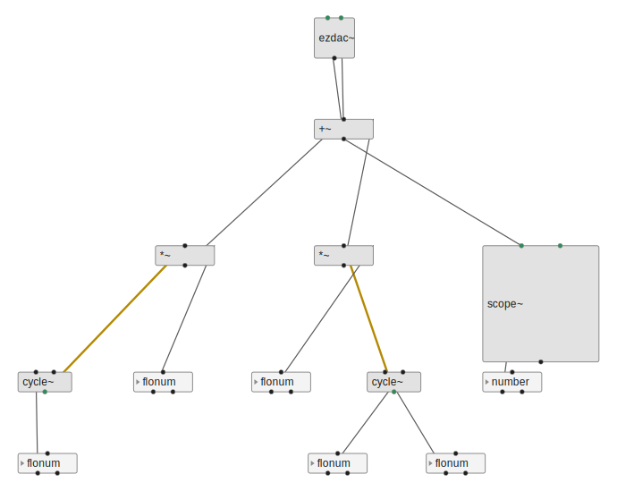

## graph-layout

### COLA (constraint)

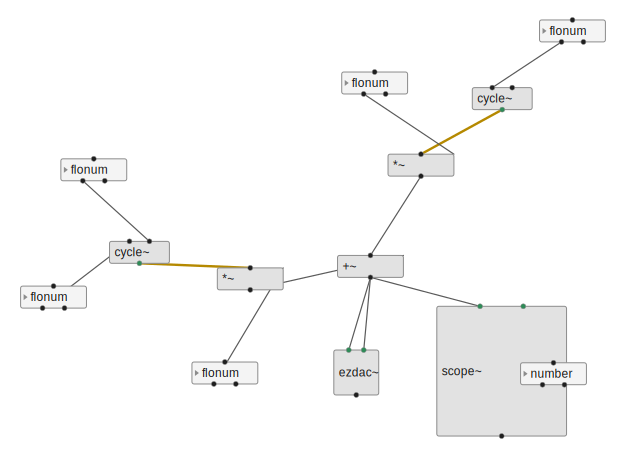

### Sugiyama (layered)

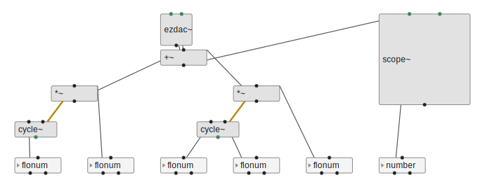

### Fruchterman-Reingold

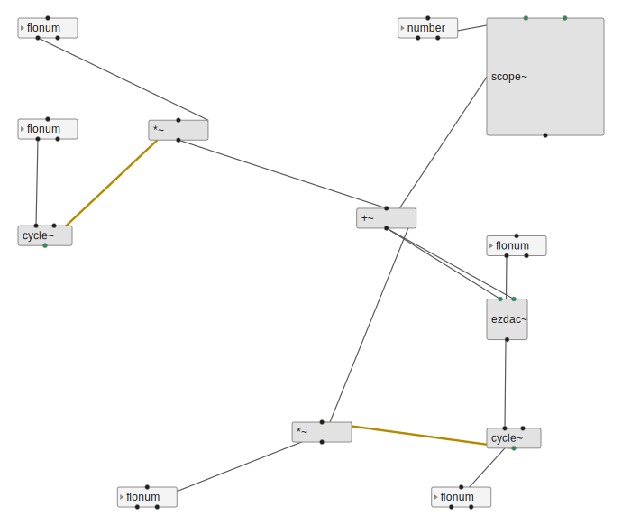

### Kamada-Kawai

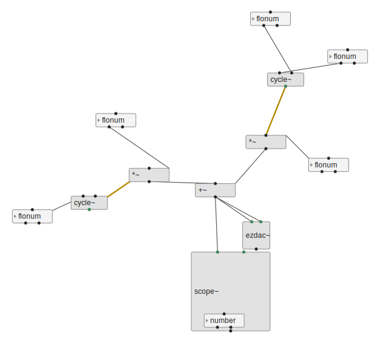

### Spectral

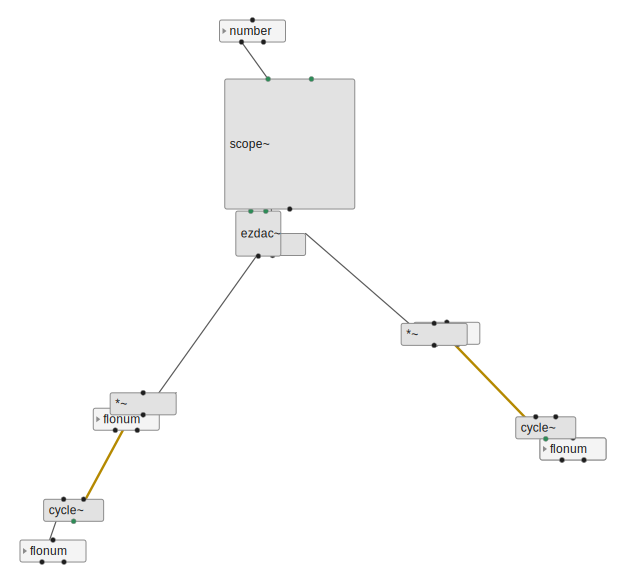

### Circular

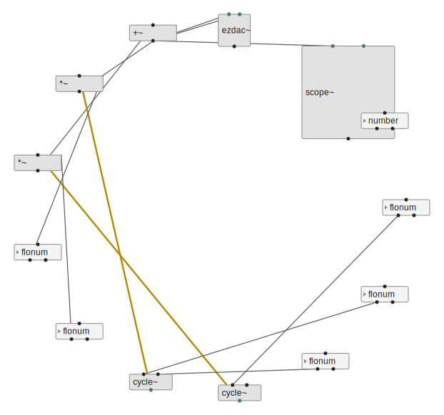

### Shell

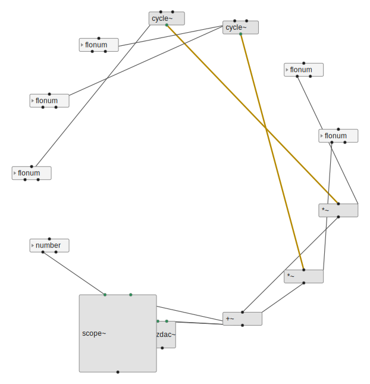

## ogdf-py

### OGDF Sugiyama (layered)

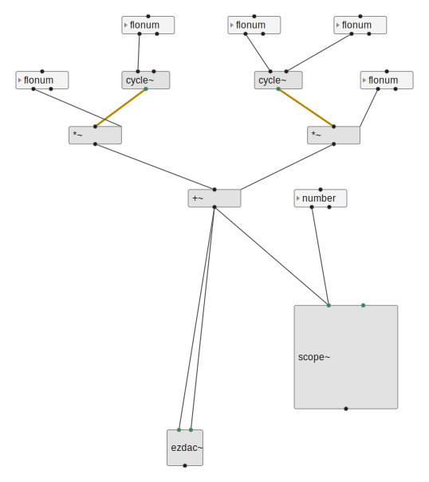

### OGDF FMMM (force-directed)

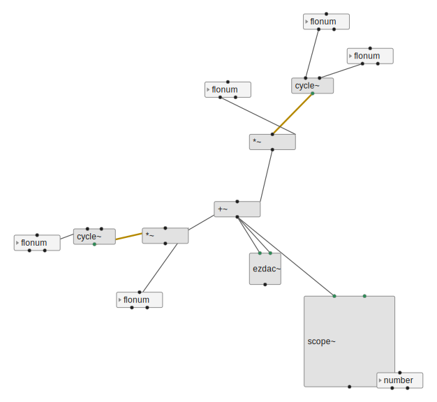

### OGDF Planarization (orthogonal)

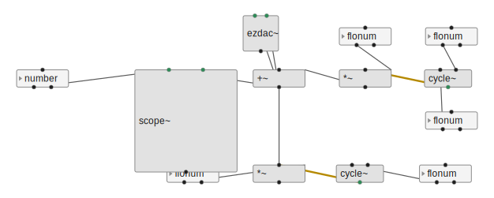
